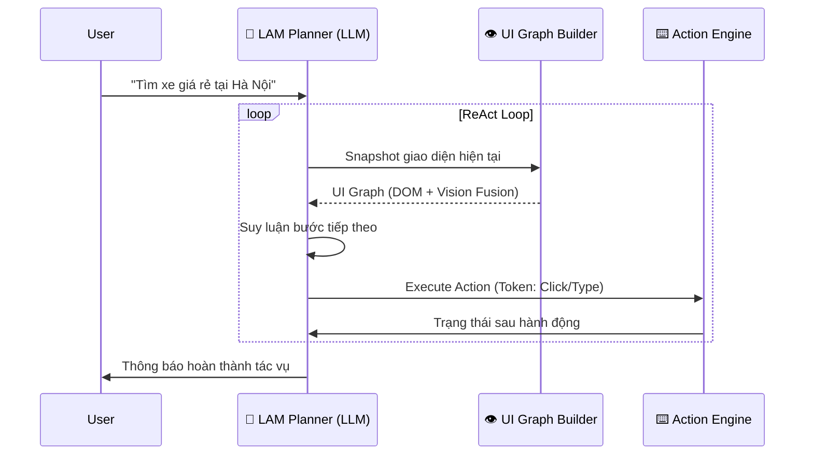

# 🚀 Hệ Sinh Thái Doanh Nghiệp AI & Tự Động Hóa (Business AI Ecosystem)

Chào mừng bạn đến với trung tâm phát triển giải pháp doanh nghiệp cao cấp. Không gian làm việc này tập trung vào việc chuyển đổi các nghiên cứu AI tiên tiến thành các ứng dụng thực tiễn có khả năng mở rộng, từ các tác nhân tự động hóa (LAM) đến các giải pháp Thương mại Điện tử (E-commerce) quy mô lớn.

---

## 💎 Danh Mục Dự Án Chi Tiết

### 🧠 1. [LAM - Large Action Model](LAM)
**Mô hình Hành động Lớn** là trái tim của hệ thống tự động hóa thông minh, cho phép AI tương tác với máy tính như một con người thực thụ.

*   **Kiến trúc Perceive-Think-Act**:
    *   **Perception (Nhận thức)**: Sử dụng cơ chế **Dual Grounding**. Hệ thống kết hợp dữ liệu từ cây DOM (Web) và phân tích thị giác (Vision) qua ảnh chụp màn hình để xây dựng một **UI Graph** thống nhất. Điều này giúp agent hiểu rõ cấu trúc và vị trí của các thành phần giao diện.
    *   **Planning (Lập kế hoạch)**: Áp dụng vòng lặp **ReAct (Reasoning + Acting)**. AI sẽ suy luận về bước tiếp theo, thực hiện hành động, và quan sát kết quả để điều chỉnh kế hoạch theo thời gian thực.
    *   **Action (Hành động)**: Các hành động được mã hóa thành **Token Sequences**, cho phép mô hình AI "nói" trực tiếp bằng các lệnh điều khiển chuột và bàn phím.
*   **Imitation Learning (Học máy mô phỏng)**: Tự động ghi lại các quỹ đạo (trajectories) thực thi để huấn luyện các model LAM tùy chỉnh trong tương lai, giúp Agent ngày càng thông minh hơn qua mỗi tác vụ.

### 🚗 2. [Self Car Web - Nền Tảng Thương Mại Điện Tử Ô Tô](Self%20car%20web)
Một giải pháp E-commerce hoàn chỉnh, bảo mật và có khả năng mở rộng cực cao, được thiết kế cho thị trường khu vực ASEAN.

*   **Công nghệ Core Backend**: Xây dựng trên nền tảng **Spring Boot 3.x** và **Java 17**, áp dụng **Saga Pattern** để đảm bảo tính toàn vẹn dữ liệu cho các giao dịch phức tạp (Đặt xe -> Thanh toán -> Xác nhận).
*   **Hệ sinh thái Mở rộng (Phase 5 & 6)**:
    *   **SelfcarCare & Finance**: Tích hợp mạng lưới bảo dưỡng và đối tác bảo hiểm/vay vốn.
    *   **Monetization**: Hệ thống đăng ký gói thành viên (Basic, Pro, Enterprise) và phí giao dịch động.
    *   **B2B & SaaS**: Cung cấp công cụ quản lý kho và API đồng bộ cho các đại lý ô tô (Cross-listing).
*   **Bảo mật Đa lớp**: Triển khai chiến lược bảo mật toàn diện chống lại các lỗ hổng OWASP, tấn công Bot, và Magecart (E-skimming) thông qua Tokenization và Virtual Patching.

### 🌐 3. [Brower Verify - Động Cơ Tự Động Hóa Chống Phát Hiện](Brower%20Verify)
Công cụ chuyên dụng cho các tác vụ cần độ tin cậy cao trên trình duyệt, đảm bảo AI hoạt động mà không bị chặn bởi các hệ thống bảo mật.

*   **Giả lập Hành vi Người (Human Emulation)**: Sử dụng các thuật toán đường cong Bezier để mô phỏng di chuyển chuột tự nhiên và các mẫu gõ phím có độ trễ biến thiên.
*   **Quản lý Danh tính (Profile Management)**: Mỗi tác vụ chạy trên một cấu hình trình duyệt (Profile) và địa chỉ Proxy riêng biệt, ngăn chặn việc liên kết dữ liệu và theo dấu phiên làm việc.
*   **Phân phối Tác vụ**: Hệ thống server điều phối cho phép chạy hàng trăm luồng tự động hóa đồng thời với cơ chế xoay vòng Proxy thông minh.

### 📦 4. [Novels - Hệ Thống Monorepo Đa Nền Tảng](Novels)
Quản lý mã nguồn tập trung sử dụng **Turborepo**, giúp tối ưu hóa quy trình phát triển cho các hệ thống có nhiều thành phần phụ thuộc.

*   **Cấu trúc Module hóa**: Chia nhỏ hệ thống thành các gói (packages) dùng chung như `Monetization`, `Shared-UI`, `Security` để tái sử dụng trên cả Web, Mobile (Android/iOS) và Desktop.
*   **Microservices Ready**: Cấu trúc thư mục được thiết kế để dễ dàng tách rời thành các service độc lập khi hệ thống tăng trưởng nóng.

---

## 🛡️ Chiến Lược An Ninh & Kiến Thức

> [!IMPORTANT]
> **Bảo mật không phải là một tính năng, mà là một nguyên tắc kiến trúc.**

Chúng tôi áp dụng các tiêu chuẩn an ninh nghiêm ngặt nhất được đúc kết trong tài liệu:
*   **[Chiến lược Bảo mật Thương mại Điện tử](Bảo%20mật%20trang%20web%20bán%20hàng%20lớn.txt)**: Phân tích chi tiết về phòng thủ DDoS, an toàn API (BOLA), và tuân thủ chuẩn PCI DSS 4.0.
*   **Quản lý Chuỗi Cung Ứng (SCA)**: Kiểm soát chặt chẽ mọi thư viện bên thứ ba thông qua SBOM (Software Bill of Materials) để ngăn ngừa các lỗ hổng như Log4Shell.

---

## 📊 Sơ Đồ Hoạt Động Của LAM Agent

---

## 🛠️ Ma Trận Công Nghệ (Technical Stack)

| Lĩnh vực | Công nghệ sử dụng |
| :--- | :--- |
| **AI Agents** | Python, OpenAI API, PyAutoGUI, Playwright, VLM (Vision Language Models) |
| **E-commerce** | Java 17, Spring Boot, MySQL, Redis, Kafka, React 18, Vite, TailwindCSS |
| **Automation** | Selenium, Chrome Extension API, Native Messaging, Proxy Management |
| **DevOps** | Turborepo, Docker Compose, GitHub Actions, pnpm, Maven |

---

**Phát triển bởi Alida** - *Kiến tạo tương lai thông qua sự kết hợp hoàn hảo giữa Trí tuệ Nhân tạo và Kỹ thuật Phần mềm.*
>>>>>>> c808049 (docs: revolutionize root README with detailed architecture and premium banner)
